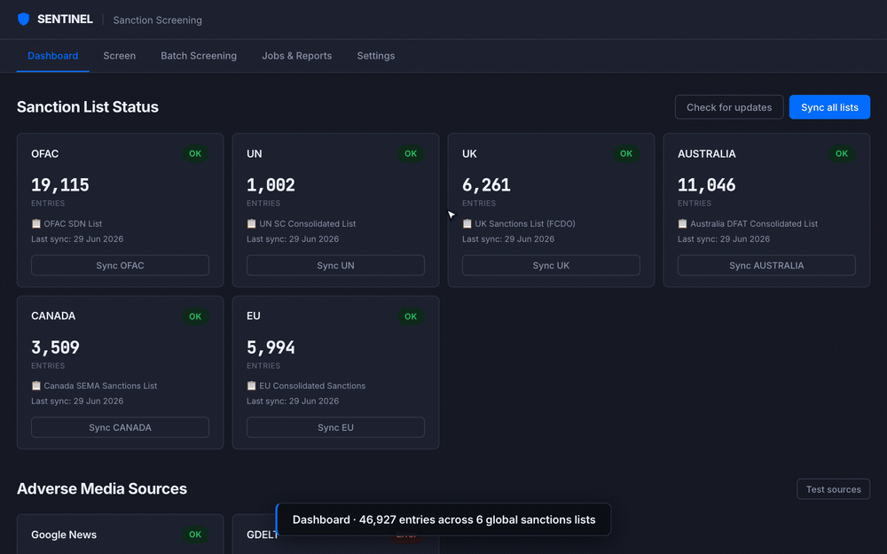

# Merchant Sanction Screening

> Screen any merchant against six global sanctions lists and adverse media in one request — fuzzy matching, single-name lookup, and bulk CSV batch jobs with a full audit trail.


A compliance screening tool for fintech and payments teams. Screens merchants against six global sanction lists and adverse media sources, with fuzzy matching, single name lookup, and bulk CSV batch processing.



▶ [Watch the full-quality MP4](docs/demo.mp4) · 🖼 [Static dashboard screenshot](docs/screenshot.png)

## What it does

- **Unified screening** — screen any name against sanctions lists, adverse media, or both in one request
- **Batch screening** — upload a CSV, select which checks to run, get a job that processes every row
- **Adverse media** — searches Google News and GDELT for fraud, corruption, sanctions violations, and other compliance-relevant news about a merchant
- **Confidence visualization** — distribution bar showing the spread of statuses (confirmed / potential / review / clear) for each batch
- **Scheduled list sync** — refreshes all six sanction lists weekly (default: Sundays 2am)
- **Audit trail** — every job and result is persisted in SQLite for compliance review
- **CSV export** — full match details for any job

## ⚠️ Adverse media: LLM classifier setup (optional but recommended)

By default, adverse media articles are classified using a **keyword classifier** — free, fast, and requires no configuration. For higher accuracy, you can switch to the **LLM classifier** (powered by Claude).

**To enable the LLM classifier:**

1. Create a `.env` file in the project root (it is gitignored — never commit it):
   ```
   ANTHROPIC_API_KEY=sk-ant-your-key-here
   ```
2. Restart the server: `npm start`
3. Open the app → **Settings → Adverse Media → Classifier mode → LLM**

**Without the API key**, the app works normally — it just uses the keyword classifier. No error is shown.

**Model used**: `claude-haiku-4-5` (fast and low-cost per article). To switch to a higher-accuracy model, change the `model` field in `src/services/media/classifiers/llm.js`.

## Tech stack

- **Backend**: Node.js (22 LTS) + Express
- **Storage**: SQLite (via `better-sqlite3`) — no external DB needed
- **Matching**: Fuse.js for fuzzy name matching with custom normalization
- **Scheduling**: node-cron
- **Frontend**: Vanilla JS + plain CSS (no framework), Inter typography
- **Files**: XML, XLSX, CSV parsers (xml2js, xlsx, csv-parse)

## Local setup

Requires **Node 22 LTS** (Node 25+ has incompatibilities with `better-sqlite3`'s native build).

```bash
nvm install 22         # if not already on 22
nvm use 22
npm install
npm start
```

The app boots on `http://localhost:3000`. On first run, the SQLite database is created at `data/sanctions.db` with default settings. Navigate to the Dashboard tab and click **Sync all lists** to download and parse all six sanction sources (~2–3 minutes).

## Key files

| Path | What |
|---|---|
| `PRODUCT.md` | Strategic context: users, brand, design principles, anti-references |
| `DESIGN.md` | Visual system: colors, typography, components, do's and don'ts |
| `src/server.js` | Express bootstrap |
| `src/routes/` | API endpoints (`screening`, `screen`, `media`, `lists`, `reports`) |
| `src/services/screening.js` | Sanctions fuzzy matching (Fuse.js) + batch job runner |
| `src/services/orchestrator.js` | Unified screening: fans out to sanctions + adverse media |
| `src/services/media/` | Adverse media fetchers (Google News, GDELT) + classifiers (keyword, LLM) |
| `src/services/listSync.js` | Sanction list downloader + parser orchestrator |
| `src/services/scheduler.js` | Cron jobs for list sync + auto batch re-screen |
| `src/parsers/` | One per sanction source: OFAC, EU, UN, UK, Australia, Canada |
| `src/public/` | Frontend (`index.html`, `js/app.js`, `css/style.css`) |

## API

| Endpoint | Purpose |
|---|---|
| `POST /api/screen/single` | Unified single name lookup — accepts `checks: ['sanctions','media']` |
| `POST /api/screen/batch` | Start a unified batch job against a previous `uploadId` |
| `GET /api/screen/jobs/:id/media-results` | Paginated adverse media results for a job |
| `GET /api/screen/jobs/:id/media-summary` | Aggregate counts by status + category |
| `GET /api/media/sources` | Adverse media fetcher health (last test, article count, errors) |
| `POST /api/media/sources/:src/sync` | Test a single fetcher (google_news, gdelt) |
| `POST /api/screening/upload` | Upload + validate a CSV; returns `uploadId` |
| `GET /api/screening/jobs` | List all screening jobs |
| `GET /api/screening/jobs/active` | Running + recently-completed jobs (header progress chip) |
| `GET /api/screening/jobs/:id/results` | Paginated sanctions results for a job |
| `GET /api/screening/template` | Download a CSV template with the expected columns |
| `GET /api/reports/jobs/:id/summary` | Aggregate counts by status / source / score range |
| `GET /api/reports/jobs/:id/export` | Full results as CSV |
| `GET /api/lists/status` | Per-source: last sync, record count, errors |
| `POST /api/lists/sync/:source` | Sync one sanction list |
| `POST /api/lists/sync-all` | Sync all six sanction lists |
| `GET /api/lists/check-updates` | HEAD-request update check (no full download) |
| `POST /api/lists/import/:source` | Manual import for sources without a live URL |

## Scheduled jobs

| Job | Default schedule | Configurable in |
|---|---|---|
| List sync | `0 2 * * 0` (Sun 2am) | Settings → Schedules |
| Auto monthly batch re-screen | `0 3 1 * *` (1st of month, 3am) — off by default | Settings → Schedules |

## Notes on the data

- The **list URLs** are hardcoded in `src/services/listSync.js` (override in Settings → List Source URLs if a government source moves).
- The **sanction entries themselves** are downloaded live from official sources, parsed, and stored in `sanctions_entries`. Replaced atomically on each sync.
- Match thresholds (confirmed ≥85%, potential ≥70%) and the cron schedules are DB-seeded defaults; all editable in Settings.

## Status

MVP. Built against the design system in `DESIGN.md`. Intended as internal operations tooling, not a customer-facing product.
